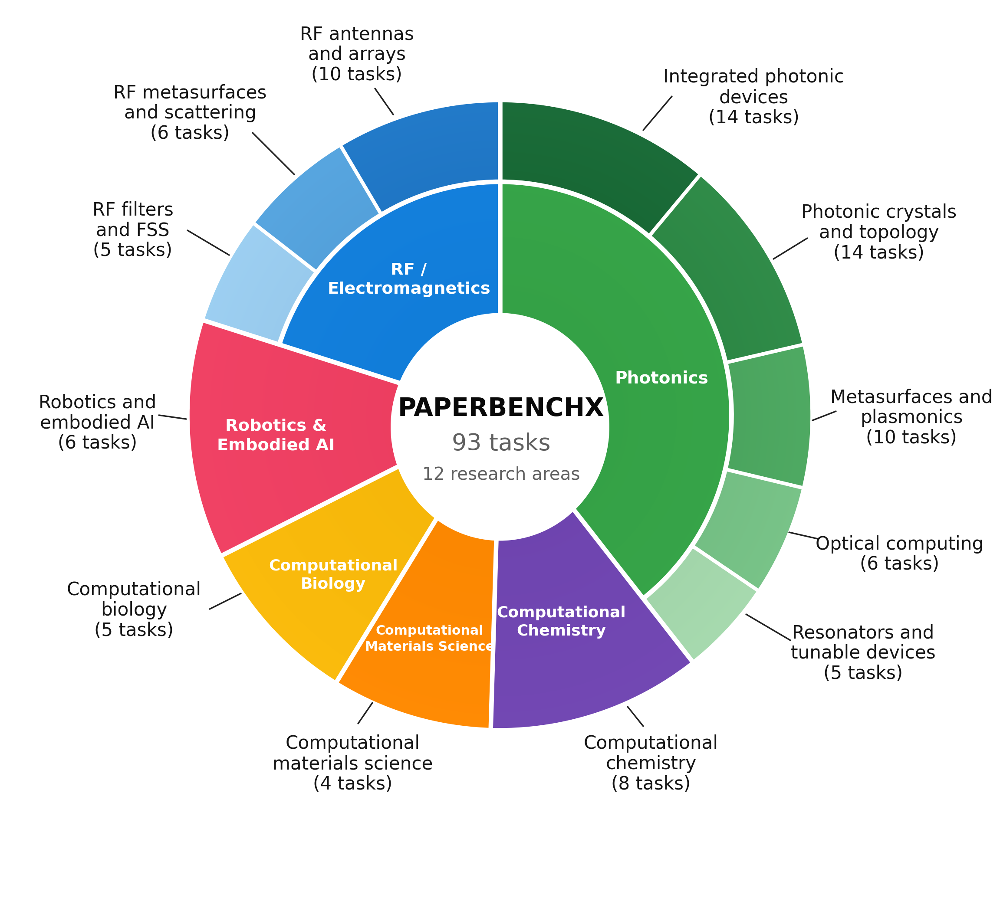

<div align="center">


<h1>PaperBenchX</h1>

### Can AI Reproduce Science Across Disciplines?

[Project website](https://unipat.ai/blog/PaperBenchX) · [Quickstart](docs/quickstart.md) · [12 public tasks](docs/tasks.md) · [Evaluation](docs/evaluation.md)


<sub>Automatically looping demo preview. An illustrative scientific reproduction workflow, not a benchmark result.</sub>

</div>

## Overview

Before a research agent can be trusted to discover something new, can it
reconstruct and verify what science already knows?

**PaperBenchX tests the complete scientific reproduction workflow:** translate a
published paper into the intended experiment, execute it in a domain-native
environment, and produce evidence another researcher can independently regenerate.
A plausible result is not enough if the submitted procedure models the wrong
system or cannot reproduce the evidence.

| Benchmark scope | Public release | Restricted evaluation set |
|---|---|---|
| **93 tasks across 12 research areas** | **12 representative tasks**, one per research area | **81 tasks**, maintained separately with limited access |

The public tasks let the community run agents, inspect evaluation methods, debug
reproduction workflows, and study the strengths and limitations of research
agents. The restricted set supports continued evaluation while reducing
contamination and preserving longer-term benchmark validity. It is not included
in this repository; access is managed separately by the maintainers.

<div align="center">



<sub>Task distribution from the PaperBenchX paper figure published on the project website. This figure describes the full benchmark, not only the 12 public tasks.</sub>

</div>

**Three capabilities, one executable contract:**

- **Reconstruct:** recover the scientific model, assumptions, geometry, parameters,
  and target observables from the paper.
- **Execute:** use native scientific tools, interpret diagnostics, and establish
  that the intended computation actually ran.
- **Validate:** regenerate artifacts and connect numerical and scientific claims
  to the evidence that supports them.

## What Is Open

All **12 public task packages** include instructions, scoring details, environment
configuration, and the corresponding evaluation resources. Their software and
asset distribution conditions differ:

| Group | Tasks | What is provided | What you must provide |
|---|---|---|---|
| **9 tasks using noncommercial scientific stacks** | 04–12 | Public environment configuration, scientific materials, and verifier resources; 04–11 include build recipes for their runtime stacks | Compute hardware |
| **3 tasks using commercial scientific software** | 01–03 | Task instructions, scoring rules, runtime requirements, and the unified evaluation framework | An authorized HFSS installation/runtime image and a valid, reachable solver license |

**Environment recipes are not a blanket redistribution license.** Papers, datasets,
model weights, scientific software, and container components retain their own
terms. Task 12 bundles neither its observations nor its weights in this repository:
its build defaults to `suermars/paperbenchx-mapgpt-r2r-full` on DockerHub, with the
runtime version pinned in the task configuration. Building and running still
require sufficient storage and GPU hardware. See the
[quickstart](docs/quickstart.md#5-special-environment-requirements) and
[commercial HFSS guide](README_HFSS.md) before provisioning a run.

## Explore the 12 Public Tasks

Each task link opens its scientific instructions. Detailed resource requirements
are in the [task catalog](docs/tasks.md).

| ID | Research area | Representative task |
|---|---|---|
| [01](tasks/01-cpw-quad-port-uwb-mimo/instruction.md) | Multi-port antennas | Matching, isolation, and radiation in a CPW UWB MIMO antenna |
| [02](tasks/02-anisotropic-coding-diffusion-metasurface/instruction.md) | Coding metasurfaces | Polarization-dependent reflection and diffuse scattering |
| [03](tasks/03-dual-passband-angular-stable-fss/instruction.md) | Frequency-selective surfaces | Dual-passband transmission and angular stability |
| [04](tasks/04-swg-anisotropic-phase-shifter-meep/instruction.md) | Integrated photonic phase shifters | Broadband differential phase in periodic SWG waveguides |
| [05](tasks/05-pt-bragg-unidirectional-invisibility-meep/instruction.md) | Non-Hermitian photonics | Unidirectional invisibility in a gain–loss Bragg grating |
| [06](tasks/06-gmr-grating-fano-meep/instruction.md) | Guided-mode resonances | Two resonance branches in a slotted multilayer grating |
| [07](tasks/07-brewster-spatial-differentiator-meep/instruction.md) | Optical analog computing | Brewster-interface spatial differentiation |
| [08](tasks/08-clc-1d-resonator-meep/instruction.md) | Anisotropic liquid-crystal optics | Polarization-selective transmission of cholesteric slabs |
| [09](tasks/09-pimarenyl-bifurcation-v2/instruction.md) | Reaction dynamics | Short-time steering in pimarenyl-cation trajectories |
| [10](tasks/10-haastrup-2018-mos2-bands/instruction.md) | Two-dimensional materials | Elastic response and spin–orbit bands of monolayer MoS2 |
| [11](tasks/11-horlbeck-2018-genetic-interactions/instruction.md) | Functional genomics | Reconstructing a human CRISPRi genetic-interaction map |
| [12](tasks/12-mapgpt-r2r/instruction.md) | Vision-and-language navigation | MapGPT mapping, prompting, and adaptive navigation |

## Quickstart

Use **Linux x86-64, Python 3.12+, Docker, and Docker Compose 2.27.0+**.
Run from the repository root:

```bash
python3 -m venv .venv
source .venv/bin/activate
python -m pip --isolated install --index-url https://pypi.org/simple -r requirements.txt
python scripts/runner_compat.py --apply
python run.py list
python run.py check --task all
```

These checks do not call a model or run a scientific experiment. To evaluate an
agent, create a private configuration and fill the solving and judge API settings
using the [configuration guide](docs/quickstart.md#3-configure-the-solving-agent-and-independent-judge):

```bash
cp .env.example .env
chmod 600 .env
```

After editing `.env`, run a CPU task and inspect the results:

```bash
python run.py check --task 06 --host
python run.py run --task 06 --concurrency 1 --job-name first-task06
python run.py summary jobs/first-task06
```

**A full run consumes compute and model API calls.** Read the task and its budgets
first. Tasks 09 and 12 each require a GPU and must run separately at concurrency 1.
Tasks 01–03 need your commercial runtime and license. Task 12's
`NAV_LLM_BASE_URL` is intentionally blank until you configure its local service.
For build-only deployment, alternate API protocols, or failure diagnosis, use the
[complete quickstart](docs/quickstart.md).

## How Evaluation Works

**Paper and task contract → executable submission → clean replay → evidence-based grading.**

The original paper's [evaluation figure](docs/evaluation.md#paper-evaluation-figure)
and [task-construction figure](docs/evaluation.md#paper-task-construction-figure)
are available in the detailed protocol.

The agent submits a runnable `reproduce.sh`, source, and permitted inputs. The
verifier removes generated outputs, replays the workflow under task-specific
isolation and resource limits, and grades the regenerated evidence. Deterministic
checks assess directly computable properties; a separately configured model-based
judge reviews scientific implementation and interpretation where required.

Each task's `tests/rubric.json` defines its own weighted criteria. A report may
explain evidence, but cannot substitute for it. Missing or infrastructure-blocked
scores are not silently converted to zero: report scores **with coverage and
failure counts**. See [evaluation details](docs/evaluation.md) for agent/verifier
separation, result interpretation, and responsible comparison.

## Repository Layout

```text
README.md               Benchmark overview and navigation
README_HFSS.md          Separate setup guide for commercial tasks 01–03
docs/                   Quickstart, task catalog, and evaluation protocol
assets/                 Small project logo, original paper figures, and demo video
run.py                  Unified Harbor launcher
.env.example            Blank API and resource configuration template
requirements.txt        Launcher dependencies
scripts/                Environment, replay, and evaluation runtime helpers
tasks/XX-task-name/
  instruction.md        Scientific goals and agent deliverables
  task.toml             Execution budgets and environment metadata
  environment/
    Dockerfile          Scientific runtime image build
    docker-compose.yaml Runtime services and mounts
    requirements.txt    Scientific runtime dependencies, where provided
    paper/              Article and supplementary materials
    starter_submission/
      reproduce.sh      Public reproduction entrypoint
      src/              Starting code, where provided
      inputs/           Fixed task inputs, where provided
  tests/                Verifier entrypoint, rubric, and evaluation resources
```

Task instructions, runtime materials, and evaluation resources are deliberately
separate. `tests/` is public for methodological inspection, but is kept separate
from agent-visible materials during evaluation. Task packages use
`schema_version = "1.1"` and names in `paperbenchx/task-name` format.

Each task owns its inputs; task09 initial states, task10 pseudopotentials and
task11 assay data are not shared across task directories. Fixed input files are
stored once under that task's `environment/starter_submission/inputs/`.
Docker builds provision the documented container paths from this directory;
workspace initialization copies the starter into the solving workspace.
Native replay uses the packaged inputs as its trusted baseline and rejects
changes to reserved files. Container paths such as `/opt/pseudo/` and
`/home/data/horlbeck/` remain available for compatibility.

The root `requirements.txt` serves the launcher and host evaluator, not the
task's scientific runtime. Task-level runtime dependencies use
`environment/requirements.txt` without changing their pinned versions. Task12
keeps its evaluator-only dependencies in `environment/requirements-evaluator.txt`.
Tasks without a separate dependency list or fixed inputs do not need empty files
or placeholder directories.

Local `.env`, `runs/`, and `jobs/` are not public-release materials. Do not publish
credentials or redistribute restricted assets through logs. Restricted benchmark
tasks are not bundled in this release. This release does not include reference
solutions.

## Community Use and Licensing

Use the demos to evaluate agents, inspect scoring, and diagnose scientific or
infrastructure failures. When reporting results, disclose the task set, model and
judge settings, budgets, attempts, coverage, and any access to public grading
resources beyond the controlled agent inputs. A result on the 12 demos is not a
result on the 81 restricted tasks.

The repository code is licensed under [MIT](LICENSE). Third-party scientific
software, papers, datasets, and model weights retain their applicable terms.
The repository license does not grant ANSYS usage rights or restricted-set access.
